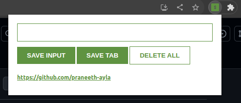

# leadTracker
This is a simple chrome extension for tracking and managing leads. You can save website URLs as leads, view them in a list, and even delete them. It also allows you to quickly add the current tab's URL as a lead if you're using the Google Chrome browser.

## Installation
* Download the extension files from the GitHub repository.
* Open Google Chrome.
* Go to chrome://extensions/.
* Enable "Developer mode" by toggling the switch in the upper-right corner.
* Click the "Load unpacked" button.
* Select the directory where you've downloaded the extension files.
* The leadTracker extension should now be installed and accessible from the Chrome toolbar.

## Usage
* Click on the leadTracker icon in the Chrome toolbar.
* Use the "Save" button to manually add website URLs as leads.
* Click the "Tab" button while using Google Chrome to add the current tab's URL as a lead.
* View and manage your leads using the extension's interface.

## Technologies Used
* HTML
* CSS
* JavaScript

## Compatibility
The leadTracker application should work in any browser that supports extensions. It has been tested on Google Chrome and Mozilla Firefox.
